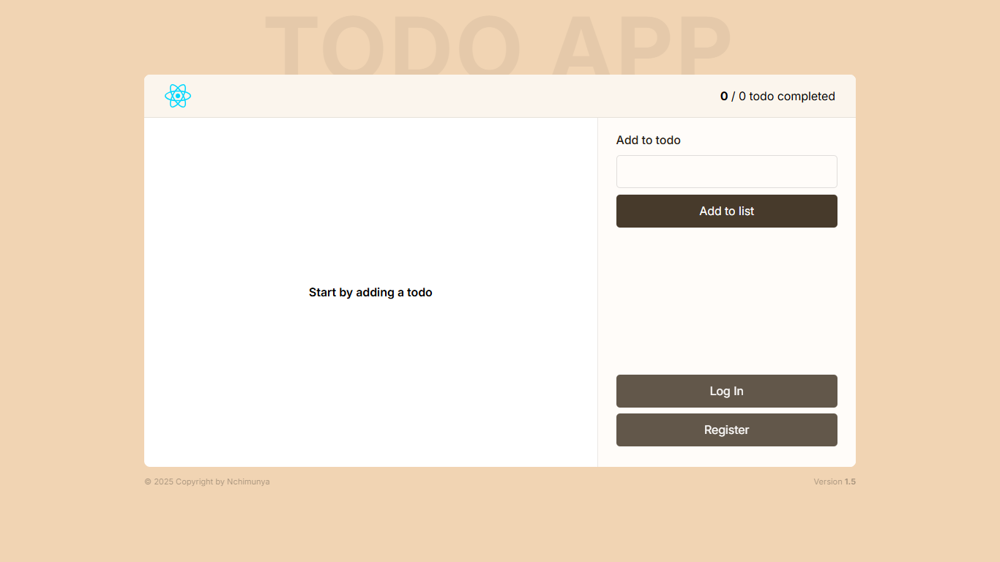

# Todo App with React, TypeScript, Tailwind CSS & Kinde Auth



A modern Todo application built with React, TypeScript, and Tailwind CSS, featuring authentication via Kinde and state management with Context API.

## Features

- ✅ Add, toggle, and delete todos
- ✨ Clean UI with Tailwind CSS styling
- 🔒 Authentication with Kinde
- 📱 Responsive design
- 💾 Data persistence with localStorage
- 🏗️ TypeScript for type safety
- 🔄 Context API for state management
- 🚀 Deployed on Vercel

## Technologies Used

- React 18
- TypeScript
- Tailwind CSS
- Kinde Authentication
- Context API
- React Hooks (useState, useEffect, useContext)
- Vercel Hosting

## Getting Started

### Prerequisites

- Node.js (v16 or later)
- npm or yarn

### Installation

1. Clone the repository:

   ```bash
   git clone https://github.com/nchimunyascripts/react-todo-app.git
   ```

2. Navigate to the project directory:

   ```bash
   cd react-todo-app
   ```

3. Install dependencies:

   ```bash
   npm install
   # or
   yarn install
   ```

4. Create a `.env` file in the root directory and add your Kinde credentials:

   ```
   VITE_KINDE_DOMAIN=your-domain.kinde.com
   VITE_KINDE_CLIENT_ID=your-client-id
   VITE_KINDE_REDIRECT_URI=http://localhost:5173
   VITE_KINDE_LOGOUT_REDIRECT_URI=http://localhost:5173
   ```

5. Start the development server:

   ```bash
   npm run dev
   # or
   yarn dev
   ```

6. Open [http://localhost:5173](http://localhost:5173) in your browser.

## Project Structure

```
src/
├── components/       # Reusable components
├── context/          # Context providers
├── hooks/            # Custom hooks
├── lib/              # Utility functions and types
├── pages/            # Page components
├── App.tsx           # Main app component
└── main.tsx          # Entry point
```

## Available Scripts

- `npm run dev`: Starts the development server
- `npm run build`: Builds the app for production
- `npm run lint`: Runs ESLint
- `npm run preview`: Previews the production build locally

## Deployment

This app is configured for easy deployment to Vercel. To deploy your own version:

1. Push your code to a GitHub repository
2. Create a new project in Vercel
3. Import your GitHub repository
4. Add your environment variables
5. Deploy!

[](https://vercel.com/new)

## Key Learnings

This project covers:

- React functional components with TypeScript
- Tailwind CSS for styling
- State management using Context API
- Custom hooks for reusable logic
- Authentication with Kinde
- Data persistence with localStorage
- Prop drilling and event handling
- Conditional rendering
- Deployment to Vercel

## Contributing

Contributions are welcome! Please open an issue or submit a pull request.

## License

MIT

---

Built with ❤️ by Nchimunya
